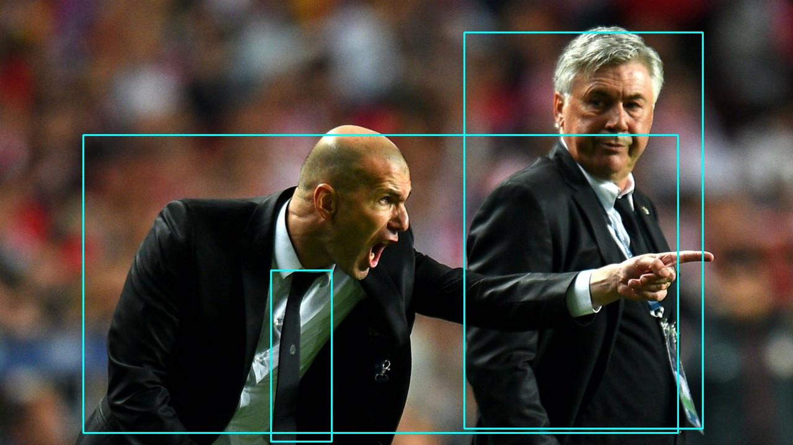
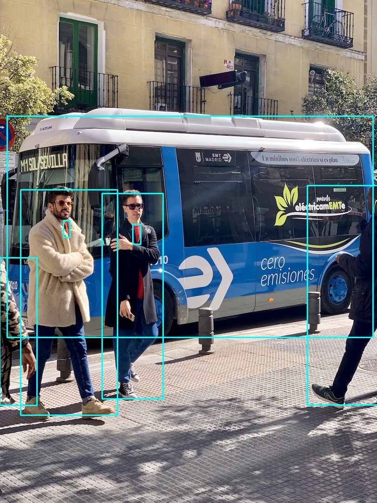
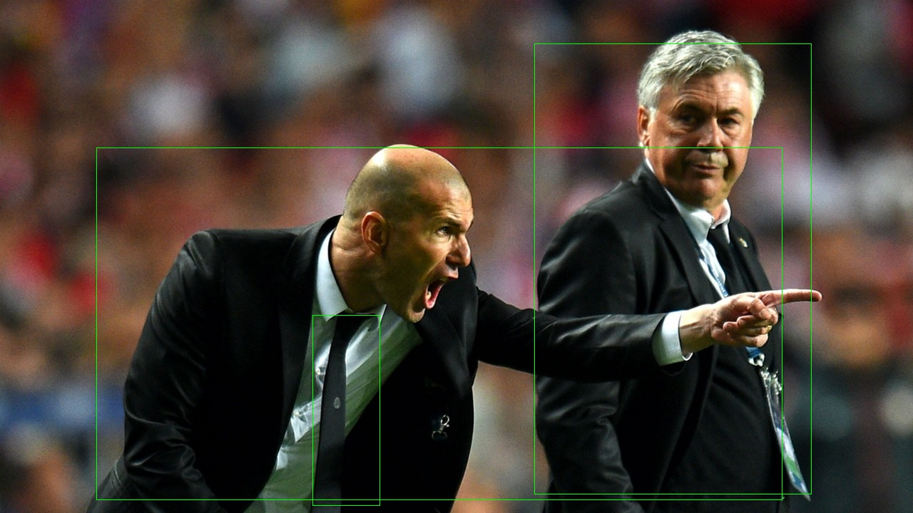

# yolov7

[代码仓库](https://github.com/dx111/mm_convert/tree/main/examples/onnx_yolov7)

1 使用官方仓库的的python程序将yolov7转为onnx模型        
```bash
python export.py --weights yolov7-tiny.pt --grid --end2end --simplify \
        --topk-all 100 --iou-thres 0.65 --conf-thres 0.35 --img-size 640 640 --max-wh 640
```
此处需要去掉--simplify参数，因为此参数会固定输入的形状，无法生成多batch模型。

2 执行转换     
请根据实际情况修改参数，此处生成的是2batch的模型
```
mm_convert \
    -f onnx \
    --model yolov7.onnx \
    --output_model yolov7.mm \
    --archs mtp_372.41 \
    --input_shapes 2,3,640,640 \
    --input_as_nhwc true \
    --insert_bn true \
    --precision qint8_mixed_float16 \
    --image_color rgb \
    --image_scale 1/255.0,1/255.0,1/255.0 \
    --add_detect true \
    --detect_bias 12,16,19,36,40,28,36,75,76,55,72,146,142,110,192,243,459,401 \
    --detect_image_shape 640,640 \
    --detect_algo yolov5
```

## python 推理
下载仓库中的infer.py文件和data目录下的两张图片，执行推理
```
python infer.py
```
会在当前目录下，保存推理python推理的结果["python_result_0.jpg", "python_result_0.jpg"]



## cpp 推理
下载仓库中的infer.cpp文件, build.sh文件和data目录下的两张图片，编译代码
```
./build.sh
```
执行推理
```
./infer.bin
```
会在当前目录下，保存推理python推理的结果["python_result_0.jpg", "python_result_0.jpg"]



## 注意事项：
1. 该脚本使用了yolov5的目标检测大算子替换原生的检测层，如果不需要，设置--add_detect false
2. 默认的detect_conf是0.3，detect_nms是0.45，类别数为80，请根据实际情况修改
3. 如需测试MaP，将detect_conf设为0.0005

## 常见问题：
1. channel不匹配：      
默认的类别数是80，255(channel)=(80(类别数)+1(分数)+4(坐标))*3(三个检测头)，设置的类别数和特征图的channel数不匹配，会报此错误
